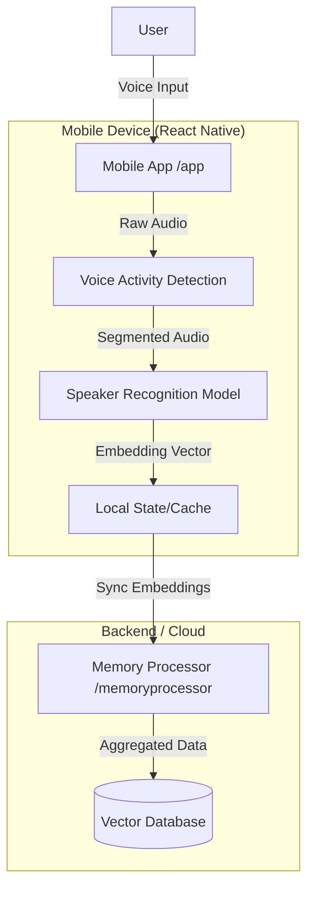

# SEIYUU

This repository contains the base source code for **Seiyuu**, split into the mobile application and the memory processing backend.

## Repository Structure

* **`/mobile-app`**: The React Native mobile application (Frontend). Handles audio recording, UI, and on-device inference.
* **`/memory-processor`**: The backend/service (likely Python/Node) responsible for creation of the embedding vector.

## Supported Voice Actors

The current `actor-memory.json` included in this release is a proof-of-concept and contains voice embeddings for only **3 specific voice actors**:

1. Katsuyuki Konishi
2. Takehito Koyasu
3. Miyuki Sawashiro

You can add more voice actors to the system by generating new vector embeddings. The process for processing audio files and updating the database is detailed in the **[Memory Processor README](memory-processor/README.md)**.

---

## Architecture

The system is designed as a **Split-Inference Architecture**. While the mobile app attempts lightweight on-device verification, the heavy memory processing and storage aggregation happen in the `memory-processor`.

### Data Flow



---

## Setup & Installation

**1. Clone the Repository**

```bash
git clone https://github.com/Karume-lab/seiyuu-base.git
cd seiyuu-base

```

**2. Component Setup**
Please refer to the specific README files in each directory for detailed installation instructions.

* **Mobile App**: [Go to Mobile App Setup](https://www.google.com/search?q=mobile-app/README.md)
* **Memory Processor**: [Go to Memory Processor Setup](https://www.google.com/search?q=memory-processor/README.md)

---

## Technical Note: Model Selection & Compatibility

During the development of the Speaker Verification module, I evaluated two State-of-the-Art (SOTA) models from the `3D-Speaker` library: **Campplus** and **ERes2Net**.

**Current Status:** The app currently uses **Campplus** running on-device via `onnxruntime-react-native`.

### The ERes2Net Challenge

While **ERes2Net** offers excellent performance benchmarks, I was unable to implement it successfully on mobile due to runtime incompatibilities.

1. **ONNX Runtime Failure:**
* Loading the raw `eres2net.onnx` model directly in React Native failed immediately. The model architecture relies on complex operators that are not part of the standard mobile ONNX opset, causing "Unresolved Operator" exceptions.


2. **TensorFlow Lite (TFLite) Conversion Failure:**
* In an attempt to bypass ONNX issues, I tried converting the model to TFLite for use with `react-native-fast-tflite`.
* **Dynamic Shapes:** ERes2Net is designed for variable-length audio. TFLite requires static shapes.
* **Flex Delegates:** Converting the dynamic graph forced the model to rely on "Flex Delegates" (embedding the full TensorFlow runtime). This bloated the app size and resulted in runtime crashes: `[Error: TFLite: Failed to allocate memory for input/output tensors! Status: unresolved-ops]`.


### Why Campplus Works

I eventually pivoted to **Campplus**, which successfully loaded via `onnxruntime-react-native` without modification. I did not attempt a TFLite conversion for Campplus simply because the ONNX implementation worked out of the box.

### Future Architecture: Moving to Cloud Inference

While on-device inference works, I plan to migrate the heavy processing to a dedicated backend (e.g., Python/Flask).

**Rationale:**

* **User Context:** Users are almost certainly online when using this app (watching Anime streams).
* **App Size:** Removing the ONNX runtime and model files (~25MB+) from the app bundle will significantly reduce the download size.
* **Performance:** Offloading allows the use of larger, more accurate models (like ERes2Net) without draining the user's battery or relying on mobile CPU limits.

## License

This project is open-sourced under the **GNU Affero General Public License v3.0 (AGPLv3)**.

* **Free Use:** You are free to use this for research, education, or open-source projects, provided your project is also open-sourced under the AGPLv3.
* **Commercial Use:** If you wish to use this code in a proprietary/closed-source commercial product (where you do not share your source code), you **must** purchase a Commercial License.

**Contact me for commercial licensing:** karume.dev+seiyuu@gmail.com
